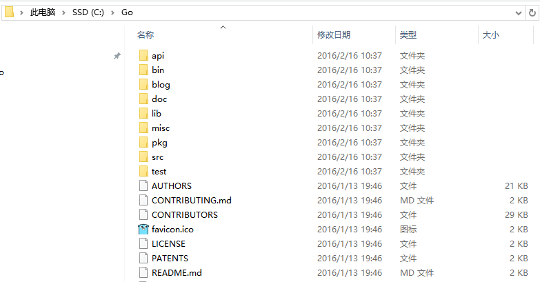
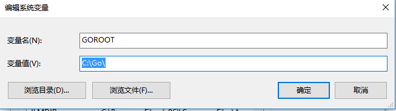
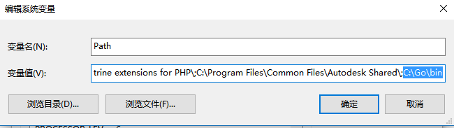
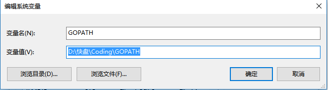
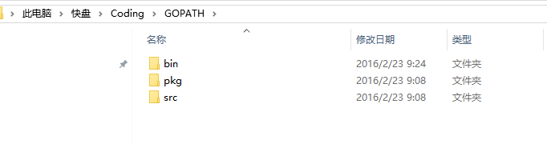
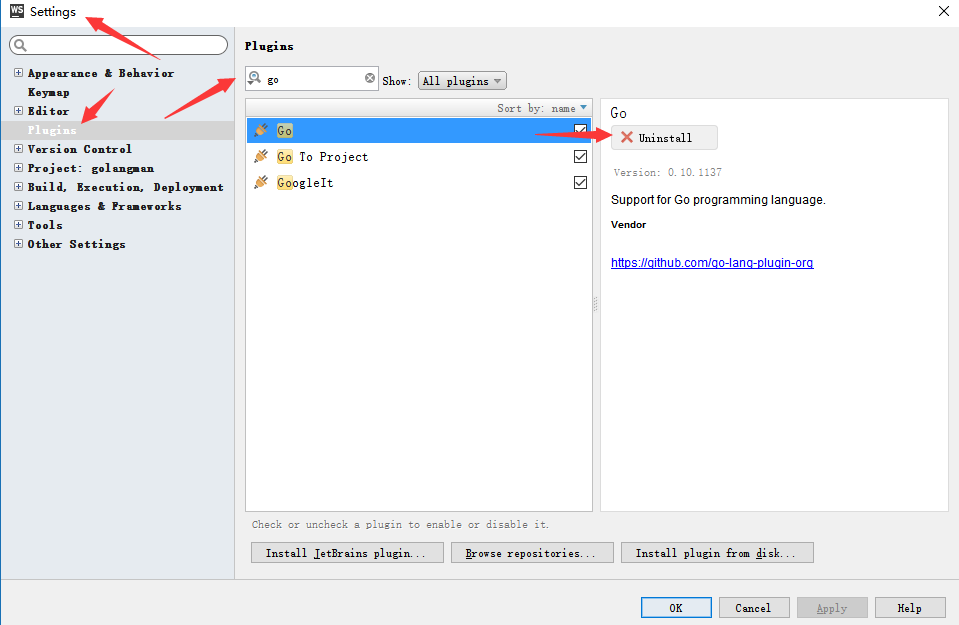
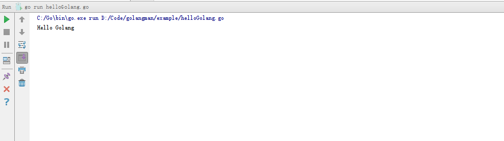
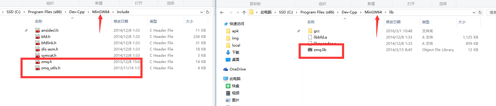
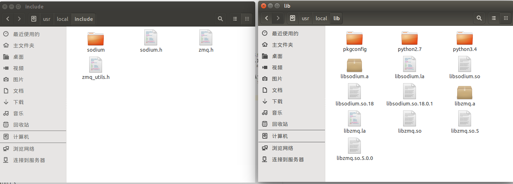
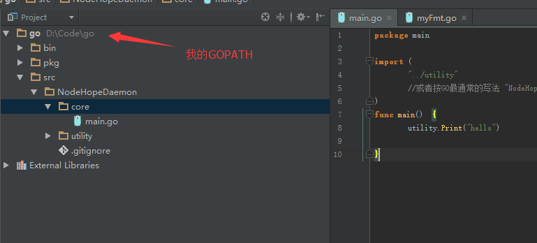

# 第零章 说明
- golangman中golang表示语言,man表示linux man命令.
- 本项目针对具有一定开发经验的开发者,不面向初学者.
- 如同man命令一样,本项目不能代替官方完整文档,更多的起到了解、帮助与速查的功能.
- 本项目可任意转载,但必须指明出处且不得删除本说明.
- 如果本项目对你有帮助,请给一颗星.https://github.com/jackhu1990/golangman.

# 第一章 快速开始

## 下载golang安装包
- [google官方地址](https://golang.org/dl/)
- [墙内地址](http://golangtc.com/download)
- 安装后目录结构



## 配置环境变量
- GOROOT
目的是告诉一些其他程序(如IDE)golang安装包安装在哪里

- PATH
目的是可以系统中直接运行go.exe,而无需进入到安装目录

- GOPATH
目的是指定go包的安装目录.（注意：在学习第四章之前，这样理解是没问题的。）
golang的包类似java的jar、c++的lib.golang的包管理类似nodejs的npm、java的maven、c#的nuget.
除了系统自带的一些包,其他包均需要下载.



## 安装IDE
个人喜好,因为我很喜欢WebStorm开发js,所以安装了WebStorm的go插件,个人可自行改变,但根据我试用多个IDE或代码编辑器的情况,强烈推荐WebStorm,其他ide光是调试功能就能把人玩死.
- WebStorm 11以上版本
- 安装 WebStorm使用的go插件
    

## Hello GOLang
- 新建一个hellogolang.go文件
```go
     package main
     import "fmt"

     func main() {
     	fmt.Println("Hello Golang")
     }
```
- WebStorm 11 会要求配置下go目录,按照步骤设置.ps:这好像一个bug.


- 鼠标右键,RUN.


# 第二章 语言只是语言

## 基础数据类型
```go

int8 int16 int32 int64
uint8 uint16...
float32 float64
string
bool

```

## 结构体
```go

type PersonBase struct{
	Name string
	Age int
}
type Boy struct{
	Person PersonBase
	Sex string
}


var person PersonBase

```
type 类似c/c++中 typedef

## 变量定义
- var
```go
var inputCount  uint32
var(
    inputCount  uint32
    outputCount uint32
    errorCount  uint32
)
inputCount = 1024
```
- var简写
```go

inputCount := 1024

```

## 这里应该有指针
```go

    var inputCountP *int
    var person PersonBase
    var personP *PersonBase
    person.Name = "jackhu"
    person.Age = 27
    personP = new(PersonBase)
    personP.Name = "gaofei"
    personP.Age = 27

```

## 常用复合数据类型
```go

a := [...]string   {"one","two"} //array
s := []string      {"one","two"} //slice
m := map[int]string{1:"one", 2:"two"} //map

```
- array和slice

    和c有区别,在Go中，数组是值。
    将一个数组赋予另一个数组会复制其所有元素。so,若将某个数组传入某个函数，它将接收到该数组的一份副本而非指针。
    数组的大小是其类型的一部分。类型 [10]int 和 [20]int 是不同的。
    array是固定分配,不可更改.在详细规划内存布局时，数组是非常有用的，有时还能避免过多的内存分配， 但它们主要用作切片的构件。
    切片保存了对底层数组的引用，若你将某个切片赋予另一个切片，它们会引用同一个数组。 若某个函数将一个切片作为参数传入，则它对该切片元素的修改对调用者而言同样可见， 这可以理解为传递了底层数组的指针。
    简单来说,数组是值,切片类似指针,指向数组.其他遵循值拷贝.


```go

func test(slice []string)(){
	slice[2]="y"
	return
}
func main() {
	s := []string{"1","2","3"}
	s1:= s;
	for i,v:=range s {
		fmt.Println(i, v)
	}
	s1[2]="w";
	for i,v:=range s {
		fmt.Println(i, v)
	}
	test(s1)
	for i,v:=range s {
		fmt.Println(i, v)
	}
}
    0 1
    1 2
    2 3
    0 1
    1 2
    2 w
    0 1
    1 2
    2 y


```

- chan

管道符号<-
简单理解:通道的目的就是为了go程序线程同步用的,类似管道pipe.
一边流入,一边流出.流出检测时如果没有数据,则一直阻塞住.
某种程度上可以把通道当作一种锁来用().当然golang自身有mutex的包.

[详细信息](http://www.imooc.com/code/7555)

- make
>内建函数 make(T, args) 的目的不同于 new(T)。它只用于创建切片、映射和信道，并返回类型为 T（而非 *T）的一个已初始化 （而非置零）的值。 出现这种用差异的原因在于，这三种类型本质上为引用数据类型，它们在使用前必须初始化。 例如，切片是一个具有三项内容的描述符，包含一个指向（数组内部）数据的指针、长度以及容量， 在这三项被初始化之前，该切片为 nil。对于切片、映射和信道，make 用于初始化其内部的数据结构并准备好将要使用的值。
[详细信息](http://docscn.studygolang.com/doc/effective_go.html#make分配)

## 条件控制语句
- if
```go
    if i := 10; i < 5 {
        fmt.Print("***********")
    }
```
- switch

和c/c++不同,go中switch更加现代化,支持string之类的类型.同时需要注意,go中的switch不需要主动写break.
```go

var name string
switch name {
case "Golang":
    fmt.Println("A programming language from Google.")
case "Rust":
    fmt.Println("A programming language from Mozilla.")
default:
    fmt.Println("Unknown!")
}

```
[更多switch用法](http://docscn.studygolang.com/doc/effective_go.html#switch)

- select

socket编程中的select函数在概念上类似,更加简化.不懂select的先学习socket编程中的select,可以很好的理解.
```go

package main

import "fmt"

func main() {
	ch4 := make(chan int, 1)
	ch4 <- 1
	for i := 0; i < 4; i++ {
		select {
		case e, ok := <-ch4:
			if !ok {
				fmt.Println("End.")
				return
			}
			fmt.Println(e)

		default:
			fmt.Println("No Data!")
			close(ch4)
		}
	}
}
    1
    No Data!
    End.

```

- for
```go

    sum := 0
    for i := 0; i < 10; i++ {
        sum += i
    }
	arr :=[...] int {1,2,3,4,5}
	for i,v:= range arr{
		fmt.Println("index:", i, "value:", v)
	}
	m := map[int]string{1:"one", 2:"two"}
	for i,v:= range m{
		fmt.Println("index:", i, "value:", v)
	}
    index: 0 value: 1
    index: 1 value: 2
    index: 2 value: 3
    index: 3 value: 4
    index: 4 value: 5
    index: 1 value: one
    index: 2 value: two

```

## 函数
- 定义
```go

func Add(addA int, addB int) (int){
    result := addA + addB
    return result
}

```
- 两个返回值
```go

func Add(addA int, addB int) (int, error){
    if addA==0 {
        return 0,errors.New("第一个参数不能为0")
    }
    result := addA + addB
    return result,nil
}
func main() {
        fmt.Println("Hello Golang")
        result,err := Add(0,10)
        if err != nil {
            fmt.Println(err)
            return
        }
        fmt.Println(result)
}
    Hello Golang
    第一个参数不能为0

```
- error
error可以假装理解为内置的类型(实际是接口),返回时errors.New("第一个参数不能为0")这样即可.

## 这里没有类吗
没有类,但是有结构体,有结构体函数.模拟类的功能.
google官方编程规范规定,包和结构体中变量名大写表示对外暴露,小写表示不对外暴露.相当于其他语言共有私有标识.此规则很多第三方接口遵守,请也遵守.
- 结构体函数
```go

package main

import "fmt"

type Cat struct {
	Name    string
	Age     int32
	Address string
}

func (cat *Cat) Grow() {
	cat.Age++
}
func main() {
	myCat := Cat{"Little C", 2, "In the house"}
	myCat.Grow()
	fmt.Printf("%v", myCat)
}

{Little C 3 In the house}

```

严格意义上来说,go没有属于结构体的函数.go函数有个特性,可以把函数归于任何类型(或任何类型的指针),相当于把函数的归属权付给了某人,某人可以直接调用函数.
如上面的例子中,函数把归属权给了结构体指针,结构体就可以调用这个函数,同时在函数内部使用这个结构体(结构体的名字当作this指针用).
另外,如果函数的归属的是结构体(而不是指针),那么结构体照样能用,但是结构体函数内修改将不能影响外部(传递的都是副本,但指针的副本解引用会是指向源对象)
请仔细理解下面的例子,至关重要,请手敲一遍理解.

```go

package main

import "fmt"

type Handle int64
func (h Handle) Show1(i int64) int64{
    h = 1
    return i + int64(h)
}
func (h *Handle) Show2(i int64) int64{
    *h = 2
    return i + int64(*h)
}

func main() {
    var hand Handle = 0
    fmt.Println(hand.Show1(100))
    fmt.Println(hand)

    fmt.Println(hand.Show2(100))
    fmt.Println(hand)
}

101
0
102
2

```


- interface
go interface效果和java的interface,c++的抽象类相同,但是不用显示声明.
go中规定,接口不用显示声明,结构体函数如果实现接口的函数,就相当于类继承了这个接口,请结合代码理解.
```go

package main

import "fmt"

type Animal interface {
	Grow()
	Move(string) string
}
type Cat struct{
	Name string
	Age int32
	Address string
}
func (cat *Cat) Grow(){
	cat.Age++
}
func (cat *Cat)Move(newAdddress string)(oldAddress string){
	oldAddress = cat.Address
	cat.Address = newAdddress
	return
}

func main() {
	myCat := Cat{"Little C", 2, "In the house"}
	animal, ok := interface{}(&myCat).(Animal)
	animal.Grow()
	fmt.Printf("%v, %v\n", ok, animal)
}
true, &{Little C 3 In the house}

```
- 接口的类型转换
关于接口,"接口的类型转换"这个知识点请仔细理解.实例中还有switch特殊的类型选择用法.

```go
//类型选择是类型转换的一种形式：它接受一个接口，在选择 （switch）中根据其判断选择对应的情况（case）， 并在某种意义上将其转换为该种类型。
// 若它已经为字符串，我们需要该接口中实际的字符串值； 若它有 String 方法，我们则需要调用该方法所得的结果。
type Stringer interface {
	String() string
}

var value interface{} // 调用者提供的其他类型值,需要转换成接口类型。
switch str := value.(type) {
case string:
	return str
case Stringer:
	return str.String()
}

```

>按照约定，只包含一个方法的接口应当以该方法的名称加上-er后缀或类似的修饰来构造一个施动着名词，如 Reader、Writer、 Formatter、CloseNotifier 等。

## defer
就是javascript中的promise模式,angularjs中的$q服务.这里比他们都要简单.
defer的语句保证在函数return之后执行.
非常优秀的设计,简化了异常情况下资源释放的问题.比如文件打开,打开后就defer close.这样即使有异常,文件也会被关闭.
```go

file,err:=os.Open(fullPath)
if err!=nil{
    return nil,err
}
defer file.Close()
```

## go程

go程相当轻量级线程,其实是croutine的go实现.相当golang语言本身集成了线程库的一些功能.同时,go程是golang高并发的核心.

go程 chan make slice 综合小例子
```go

package main

import "fmt"

func sum(a []int, c chan int) {
	sum := 0
	for _, v := range a {
		sum += v
	}
	c <- sum //将和送入c
}

func main() {
	a := []int{1, 2, 3, 4, 5, 6}

	c := make(chan int)

	go sum(a[len(a)/2:], c)
	go sum(a[:len(a)/2], c)

	x, y := <-c, <-c //从c中获取

	fmt.Println(x,"+", y,"=", x+y)
}


```
谈到线程就避免不了锁的概念,golang中有mutex,适当的使用chan也是一种不错的选择,用法和其他语言所得用法一样,这里就不举例了.

## 恐慌panic与恢复recover
类似c++,java中的异常.panic就是抛出异常,recover就是捕获异常.
```go

package main

import (
	"errors"
	"fmt"
)

func innerFunc() {
	defer func(){ //尝试移动本段代码查看效果
		if p:=recover(); p!=nil{
			fmt.Printf("Fatal error: %s\n",p)
		}
	}()
	fmt.Println("Enter innerFunc")
	panic(errors.New("Occur a panic!"))
	fmt.Println("Quit innerFunc")
}

func outerFunc() {

	fmt.Println("Enter outerFunc")
	innerFunc()
	fmt.Println("Quit outerFunc")
}

func main() {
	fmt.Println("Enter main")
	outerFunc()
	fmt.Println("Quit main")
}

    Enter main
    Enter outerFunc
    Enter innerFunc
    Fatal error: Occur a panic!
    Quit outerFunc
    Quit main


```

## 说下包

包可以自定义,可以从网上下载.
从网上下载github上的[websocket包](github.com/gorilla/websocket),在命令行上敲入
```
go get github.com/gorilla/websocket
```

## 第三方go包
网上很多的go包都是运用cgo的技术生成的，比如常用gozmq包，了解下里面的原理，对于怎么在windows、linux上跨平台使用包很有帮助，不然这里面的坑就会把你玩死。
cgo简单来说就是一种go调用c的技术，原理就是先写一层wrapper，再在里面调用c库，最后封装成go包。[详情](http://googollee.blog.163.com/blog/static/1159411201031812128593/)
这里面需要注意，go包本身是跨平台的，但是里面实际调用的c库却是不跨平台的（windows是windows的库，linux是linux的库，如果涉及到动态链接库，windows上需要在生成的go程序同级配套dll，linux需要配套so）
github上的很多go包，在linux上安装可能很简单，比如[zmq4]（https://github.com/pebbe/zmq4）
按照提示先下载libsodium源码，configure、make、make install ；再下载zmq源码configure、make、make install然后go get github.com/pebbe/zmq4,这样包就安装成功了。
而在windows上，因为使用的cgo，要求在windows上安装一个gcc的编译环境，这里安装的mingw64，然后下载windos上的库，再把.h .lib 文件分别拷贝到mingw64安装目录的include，lib目录，还要把lib名字改成和.h名字对应的名字（zmq.h 对应zmq.lib），然后包才有可能安装成功。
最后运行时，需要把dll或者so文件拷贝到go程序目录里。

这里总结，纯go包跨平台，cgo不算跨平台。




## 更多知识点

- .接口类型断言 .() 
```
	x.(y) 断言x中的条目实现了y
```

## FAQ

    [FAQ](http://docscn.studygolang.com/doc/faq#Google使用Go)

## 中文站

    [中文站文档资料站](http://docscn.studygolang.com/doc/)


# 第三章 从写些小工具开始

- 字符串操作
```go

package main

import (
	"fmt"
	"strings"
)

func main() {
	name := "harry potty"
	arr := strings.Split(name, " ")
	fmt.Println(arr)
	arr2 := strings.Join(arr, "#")
	fmt.Println(arr2)
	str := strings.Replace(name, "harry", "\\t", -1)
	fmt.Println(str)
}

[harry potty]
harry#potty
\t potty


```
- json操作

```go

package main

import (
	"encoding/json"
	"fmt"
)

type Person struct {
	Name string
	Age  int
	secret string
}
type Girl struct {
	Person Person
	Sexy    bool
}

func main() {
	defer func() {
		fmt.Println("程序结束了")
	}()
	person := Person{"胡彦春", 18, "秘密是小写的,不会出现在json中,很有意思的特性"}
	gilr := Girl{person, true}
	b, err := json.Marshal(gilr)
	if err != nil {
		fmt.Print(err)
	}
	fmt.Print(string(b))


}

{"Person":{"Name":"胡彦春","Age":18},"Sexy":true}程序结束了

```
- httpServer
```go

package main

import (
"net/http"
)

func SayHello(w http.ResponseWriter, req *http.Request) {
w.Write([]byte("Hello"))
}

func main() {
http.HandleFunc("/hello", SayHello)
http.ListenAndServe(":8001", nil)

}

访问 http://localhost:8001/hello 返回Helo

```

- http Get Post操作
```go

package main

import (
	"net/http"
	"io/ioutil"
	"fmt"
)

func httpGet() {
	resp, err := http.Get("http://localhost:8001/hello")
	if err != nil {
		// handle error
	}

	defer resp.Body.Close()
	body, err := ioutil.ReadAll(resp.Body)
	if err != nil {
		// handle error
	}

	fmt.Println(string(body))
}

```
[POST操作等更多信息](http://www.01happy.com/golang-http-client-get-and-post/)


- 文件操作

基本上和c操作文件没有大区别,概念都一样

```go

package main

import (
    "bufio"
    "bytes"
    "fmt"
    "io"
    "os"
    "path/filepath"
)

func read(r io.Reader) ([]byte, error) {
    br := bufio.NewReader(r)
    var buf bytes.Buffer
    for {
        ba, isPrefix, err := br.ReadLine()
        if err != nil {
            if err == io.EOF {
                break
            }
        }
        buf.Write(ba)
        if !isPrefix {
            buf.WriteByte('\n')
        }
    }
    return buf.Bytes(), nil
}
func readFile(filename string) ([]byte, error) {
    parentPath, err := os.Getwd()
    if err != nil {
        return nil, err
    }
    fullPath := filepath.Join(parentPath, filename)
    file, err := os.Open(fullPath)
    if err != nil {
        return nil, err
    }
    defer file.Close()
    return read(file)
}
func main() {
    fileName := "example/FileTest.go"
    data, err := readFile(fileName)
    if err != nil {
        fmt.Printf("erris%v", err)
    }
    fmt.Printf("Thecontentof'%s':\n%s\n", fileName, data)
}


```

- redis


```go

package main

import (
    "github.com/garyburd/redigo/redis"
    "fmt"
    "time"
)

func main() {
    conn , err := redis.DialTimeout("tcp", "127.0.0.1:6379", 0, 1*time.Second, 1*time.Second)
    if err != nil {
        panic(err)
    }
    defer conn.Close()
    size ,err:= conn.Do("DBSIZE")
    fmt.Printf("size is %d \n",size)

    _,err = conn.Do("SET","user:user0",123)
    _,err = conn.Do("SET","user:user1",456)
    _,err = conn.Do("APPEND","user:user0",87)

    user0,err := redis.Int(conn.Do("GET","user:user0"))
    user1,err := redis.Int(conn.Do("GET","user:user1"))

    fmt.Printf("user0 is %d , user1 is %d \n",user0,user1)
}


```

[更多例子](https://github.com/garyburd/redigo/tree/master/redis)

- websocket
```go

package main

import (
    "flag"
    "html/template"
    "log"
    "net/http"

    "github.com/gorilla/websocket"
)

var addr = flag.String("addr", "localhost:8080", "http service address")

var upgrader = websocket.Upgrader{} // use default options

func echo(w http.ResponseWriter, r *http.Request) {
    c, err := upgrader.Upgrade(w, r, nil)
    if err != nil {
        log.Print("upgrade:", err)
        return
    }
    defer c.Close()
    for {
        mt, message, err := c.ReadMessage()
        if err != nil {
            log.Println("read:", err)
            break
        }
        log.Printf("recv: %s", message)
        err = c.WriteMessage(mt, message)
        if err != nil {
            log.Println("write:", err)
            break
        }
    }
}

func home(w http.ResponseWriter, r *http.Request) {
	homeTemplate.Execute(w, "ws://"+r.Host+"/echo")
}

func main() {
    flag.Parse()
    log.SetFlags(0)
    http.HandleFunc("/echo", echo)
    http.HandleFunc("/", home)
    log.Fatal(http.ListenAndServe(*addr, nil))
}

var homeTemplate = template.Must(template.New("").Parse(`
<!DOCTYPE html>
    <head>
    <meta charset="utf-8">
    <script>
    window.addEventListener("load", function(evt) {
        var output = document.getElementById("output");
        var input = document.getElementById("input");
        var ws;
        var print = function(message) {
            var d = document.createElement("div");
            d.innerHTML = message;
            output.appendChild(d);
        };
        document.getElementById("open").onclick = function(evt) {
            if (ws) {
                return false;
            }
            ws = new WebSocket("{{.}}");
            ws.onopen = function(evt) {
                print("OPEN");
            }
            ws.onclose = function(evt) {
                print("CLOSE");
                ws = null;
            }
            ws.onmessage = function(evt) {
                print("RESPONSE: " + evt.data);
            }
            ws.onerror = function(evt) {
                print("ERROR: " + evt.data);
            }
            return false;
        };
        document.getElementById("send").onclick = function(evt) {
            if (!ws) {
                return false;
            }
            print("SEND: " + input.value);
            ws.send(input.value);
            return false;
        };
        document.getElementById("close").onclick = function(evt) {
            if (!ws) {
                return false;
            }
            ws.close();
            return false;
        };
    });
    </script>
    </head>
    <body>
    <table>
        <tr>
            <td valign="top" width="50%">
                <p>Click "Open" to create a connection to the server,
                "Send" to send a message to the server and "Close" to close the connection.
                You can change the message and send multiple times.
                <p>
            <form>
                <button id="open">Open</button>
                <button id="close">Close</button>
                <p><input id="input" type="text" value="Hello world!">
                <button id="send">Send</button>
            </form>
            </td>
            <td valign="top" width="50%">
                <div id="output"></div>
            </td>
        </tr>
        </table>
    </body>
</html>
`))

```
[更多websocket例子](https://github.com/gorilla/websocket/tree/master/examples)

- options
比自带的flag更强大的命令行工具,帮助服务器程序自动生成命令行

```go

package main

import (
    "github.com/voxelbrain/goptions"
    "os"
    "time"
)

func main() {
    options := struct {
        Servers  []string      `goptions:"-s, --server, obligatory, description='Servers to connect to'"`
        Password string        `goptions:"-p, --password, description='Don\\'t prompt for password'"`
        Timeout  time.Duration `goptions:"-t, --timeout, description='Connection timeout in seconds'"`
        Help     goptions.Help `goptions:"-h, --help, description='Show this help'"`

        goptions.Verbs
        Execute struct {
            Command string   `goptions:"--command, mutexgroup='input', description='Command to exectute', obligatory"`
            Script  *os.File `goptions:"--script, mutexgroup='input', description='Script to exectute', rdonly"`
        } `goptions:"execute"`
        Delete struct {
            Path  string `goptions:"-n, --name, obligatory, description='Name of the entity to be deleted'"`
            Force bool   `goptions:"-f, --force, description='Force removal'"`
        } `goptions:"delete"`
    }{ // Default values goes here
        Timeout: 10 * time.Second,
    }
    goptions.ParseAndFail(&options)
}

```

[更多列子](https://github.com/voxelbrain/goptions)


- zmq

server
```go

package main

import (
    zmq "github.com/pebbe/zmq4"
    "github.com/pebbe/zmq4/examples/kvsimple"

    "fmt"
    "math/rand"
    "time"
)

func main() {
    //  Prepare our context and publisher socket
    publisher, _ := zmq.NewSocket(zmq.PUB)
    publisher.Bind("tcp://*:5556")
    time.Sleep(200 * time.Millisecond)

    kvmap := make(map[string]*kvsimple.Kvmsg)
    rand.Seed(time.Now().UnixNano())

    sequence := int64(1)
    for ; true; sequence++ {
        //  Distribute as key-value message
        kvmsg := kvsimple.NewKvmsg(sequence)
        kvmsg.SetKey(fmt.Sprint(rand.Intn(10000)))
        kvmsg.SetBody(fmt.Sprint(rand.Intn(1000000)))
        err := kvmsg.Send(publisher)
        kvmsg.Store(kvmap)
        if err != nil {
            break
        }
    }
    fmt.Printf("Interrupted\n%d messages out\n", sequence)
}

```

client

```go

package main

import (
    zmq "github.com/pebbe/zmq4"
    "github.com/pebbe/zmq4/examples/kvsimple"

    "fmt"
)

func main() {
    //  Prepare our context and updates socket
    fmt.Println("zmq test")
    updates, _ := zmq.NewSocket(zmq.SUB)
    updates.SetSubscribe("")
    updates.Connect("tcp://localhost:5556")

    kvmap := make(map[string]*kvsimple.Kvmsg)

    sequence := int64(0)
    for ; true; sequence++ {
        kvmsg, err := kvsimple.RecvKvmsg(updates)
        if err != nil {
            break //  Interrupted
        }
        fmt.Println(kvmsg.GetBody())
        kvmsg.Store(kvmap)
    }
    fmt.Printf("Interrupted\n%d messages in\n", sequence)
}


```

    
    
    
# 第四章 程序组织与自定义包编写

到此为之，都是在涂鸦式的玩具编程，真正开始做起项目来，是需要对程序进行组织的。比如你可能定义一些功能函数，定义一些模块，这时需要自己进行一些的封装。
go中并不存在传统上先include文件，然后引用的功能。任何定义好的模块都需要封装成包以后才能复用。go强制要求这一点，初用可能很不习惯，但是慢慢就会体会到这里面的好处。

好了，先把以前联系的代码都删了吧，让我们从真正的工程开始玩。

进入GOPATH目录下，SRC目录下，建立一个新的文件夹：utility。也可以建立多层文件夹，这个随意。
然后里面新建go文件，myFmt.go

```go

package utility

import "fmt"

func Print(str string)  {
    fmt.Println(str)
}


```

 回到GOPATH目录下，SRC目录下，新建一个文件夹： myProject
 然后里面建立go文件，main.go
 ```go

package main

import (
    "../utility"
    //或者按GO最通常的写法
    //"NodeHopeDaemon/utility"，这里面以GOPATH/SRC为基础目录的（概念上的）绝对路径
)
func main()  {
    utility.Print("hello")

}

 输出结果
 hello

 ```

 例如我的目录结构为
 

 还记得第一章说的GOPATH的理解问题吗，在这里就需要更正了，GOPATH不仅仅只是用来安装包，更常规的概念是当作工作区来用。


